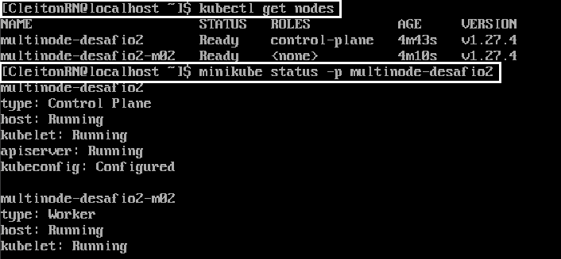
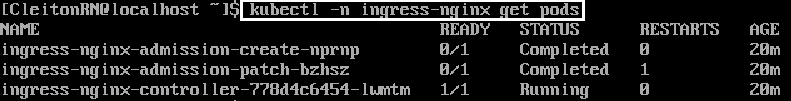
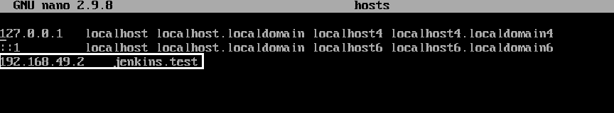
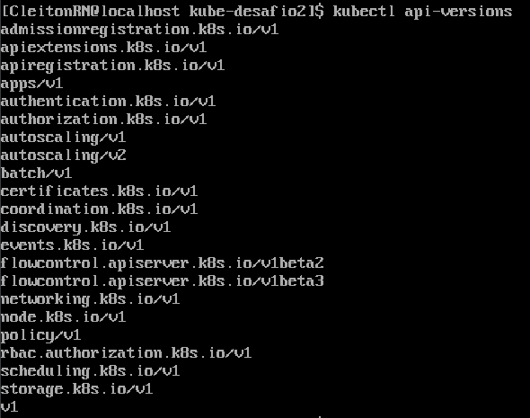

<p align="center">
  <a href="" rel="noopener">
 </a>
</p>

<h1 align="center">Fazendo o deploy k8s cluster com 1 master e 1 node no Oracle Linux</h1> 
<p align="center"><i>Deploy de um Cluster com 1 master e 1 node, configurando o ingress e fazendo o deploy do jenkins, com persistência de dados</i></p>

## Desafios anteriores:
- [Desafio 1 - Instalando o minikube e as ferramentas necessárias para utilizar o Kubernetes no Oracle Linux](https://github.com/CleitonOS/compass-kubernetes-desafio1)

## 📝 Tabela de conteúdos
- [Usando um multi-node clusters através do minikube (Passo 1)](#step1)
- [Instalando o controlador ingress-nginx (Passo 2)](#step2)
- [Configurando o jenkins no minikube (Passo 3)](#step3)
- [Referências](#documentation)

## ⚙️ Usando um multi-node clusters através do minikube (Passo 1)<a name = "step1"></a>

São pré-requisitos ter instalado:
- Minikube 1.10.1 ou maior.
- Kubectl

1. Inicie um cluster com 2 nodes a partir do driver da sua escolha.

    ```
    minikube start --nodes 2 -p multinode-desafio
    ```
    
    - No meu caso, vou nomear como "multinode-desafio".

2. Cheque a lista e o status do seus nodes:

- Lista dos nodes:

    ```
    kubectl get nodes
    ```

- Informações de status:
    ```
    minikube status -p multinode-desafio
    ```

- Resultados dos comandos:

    


## 🔽 Instalando o controlador ingress-nginx (Passo 2)<a name = "step2"></a>

1. Se você não tiver o Helm ou preferir usar um manifesto YAML, poderá executar o seguinte comando:

    ```
    kubectl apply -f https://raw.githubusercontent.com/kubernetes/ingress-nginx/controller-v1.8.2/deploy/static/provider/cloud/deploy.yaml
    ```

    OU/E

- Ative o NGINX Ingress Controller, executando o seguinte comando:

    ```
    minikube addons enable ingress
    ```

2. Verifique se o NGINX Ingress Controller está em execução

    ```
    kubectl get pods -n ingress-nginx
    ```

    

3. Agora vamos criar uma "Ingress rule":

- Antes de qualquer coisa, vamos precisar do IP do cluster do minikube, para isso use este comando:

    ```
    minikube ip
    ```

- Escolha ou crie o diretório onde o arquivo vai ser criado.

- Digite o seguinte comando:

    ```
    touch jenkins-ingress.yaml
    ```

- Use o editor de textos de sua preferência para editar o arquivo.

    ```
    sudo vim jenkins-ingress.yaml
    ```

- Dentro do arquivo insira:

    ```yaml
    apiVersion: networking.k8s.io/v1
    kind: Ingress
    metadata:
      name: jenkins-ingress
      annotations:
        kubernetes.io/ingress.class: nginx
        nginx.ingress.kubernetes.io/rewrite.target: /
    spec:
        rules:
          - host: jenkins.test
            http:
                paths:
                  - path: /
                    pathType: Prefix
                    backend:
                      service:
                        name: jenkins
                        port:
                          number: 8080
    ```

    - Substitua "jenkins.test" pelo DNS que você configura no "/etc/hosts".

4. Adicionando uma entrada de hosts personalizada

- Vamos associar jenkins.test (DNS para uso local) ao endereço IP do cluster Minikube. (Lembre-se você pode pegar o IP do minikube com "minikube ip")

  ```
  nano /etc/hosts
  ```

  


## 🔽 Configurando o jenkins no minikube (Passo 3)<a name = "step3"></a>

1. Clonando o repositório com os arquivos de manifesto do Jenkins/Kubenertes

  ```
  git clone https://github.com/scriptcamp/kubernetes-jenkins
  ```

2. Criando um namespace para o Jenkins, para categorizar todas as ferramentas relacionadas de DevOps com uma separação por "namespace" de outras aplicações.

  ```
  kubectl create namespace devops-tools
  ```

3. Acesse o diretório que está com os arquivos de manifesto que normalmente se chama: "kubernetes-jenkins"

  ```
  cd kubernetes-jenkins
  ```

4. Crie o arquivo "ServiceAccount.yaml" ou copie do manifesto e edite conforme suas necessidades.

  ```yaml
  ---
  apiVersion: rbac.authorization.k8s.io/v1
  kind: ClusterRole
  metadata:
    name: jenkins-admin
  rules:
    - apiGroups: [""]
      resources: ["*"]
      verbs: ["*"]
  ---
  apiVersion: v1
  kind: ServiceAccount
  metadata:
    name: jenkins-admin
    namespace: devops-tools
  ---
  apiVersion: rbac.authorization.k8s.io/v1
  kind: ClusterRoleBinding
  metadata:
    name: jenkins-admin
  roleRef:
    apiGroup: rbac.authorization.k8s.io
    kind: ClusterRole
    name: jenkins-admin
  subjects:
  - kind: ServiceAccount
    name: jenkins-admin
    namespace: devops-tools
  ```

  - O 'serviceAccount.yaml' cria um clusterRole 'jenkins-admin', uma ServiceAccount 'jenkins-admin' e vincula o 'clusterRole' à conta de serviço.
  - A função de cluster 'jenkins-admin' tem todas as permissões para gerenciar os componentes do cluster.

- Crie "serviceAccount" usando o kubectl:

  ```
  kubectl apply -f serviceAccount.yaml
  ```

5. Criando um recurso de "Persistent Volume" para o Jenkins:

- Caso queira se certificar em relação a versões das APIs disponiveis do kubernetes, utilize esse comando:

    ```
    kubectl api-versions
    ```

    


- Crie o arquivo de "volume.yaml" para configurar o volume que vai ser persistido:

    ```
    touch volume.yaml
    sudo vim volume.yaml 
    ```

- Conteúdo que vai ser inserido no arquivo:

    ```yaml
    kind: StorageClass
    apiVersion: storage.k8s.io/v1
    metadata:
      name: local-storage
    provisioner: kubernetes.io/no-provisioner
    volumeBindingMode: WaitForFirstConsumer
    ---
    apiVersion: v1
    kind: PersistentVolume
    metadata:
      name: jenkins-pv-volume
      labels:
        type: local
    spec:
      storageClassName: local-storage
      claimRef:
        name: jenkins-pv-claim
        namespace: devops-tools
      capacity:
        storage: 10Gi
      accessModes:
        - ReadWriteOnce
      local:
        path: /mnt
      nodeAffinity:
        required:
          nodeSelectorTerms:
          - matchExpressions:
            - key: kubernetes.io/hostname
              operator: In
              values:
              - worker-node01
    ---
    apiVersion: v1
    kind: PersistentVolumeClaim
    metadata:
      name: jenkins-pv-claim
      namespace: devops-tools
    spec:
      storageClassName: local-storage
      accessModes:
        - ReadWriteOnce
      resources:
        requests:
      storage: 3Gi
    ```

    - **Importante**: troque em "values" "worker-node01" pelo **nome do seu Worker Node**.

    - O "Persistent Volume" é uma abstração que representa uma unidade de armazenamento persistente no cluster. Ele permite que você acesse e compartilhe o armazenamento entre os pods de seus aplicativos.

    - Além disso, através desse arquivo é especificada as características do volume, como capacidade de armazenamento, modo de acesso e a localização física do armazenamento, que pode ser um diretório no Nó do cluster, um disco ou outro recurso de armazenamento físico.

    - O **Persistent Volume Claim** é usado para solicitar um recurso de **"Persistent Volume"**. Ele é uma maneira de associar um volume persistente a um pod.

- Crie o volume usando kubectl:

  ```
  kubectl create -f volume.yaml
  ```

5. Implante o Jenkins com os recursos criados.

- Vamos criar o arquivo de "deployment" com algumas alterações em relação ao do manifesto.
- Além disso, vamos incluir o "service" que expõe o Jenkins como um serviço dentro do cluster.

    ```
    touch deployment.yaml
    sudo vim deployment.yaml 
    ```

    ```yaml
    apiVersion: v1
    kind: List
    items:
    - apiVersion: v1
      kind: Service
      metadata:
        name: jenkins
        namespace: devops-tools
        labels:
          app: jenkins
      spec:
        # 1) Create Nginx Ingress
        # 2) Configure basic auth in Ingress for jenkins.mydomain.com
        # 3) Configure Let's Encrypt certs in Kube for jenkins.mydomain.com
        # 4) Route traffic: User --https--> Ingress [Basic Auth + TLS Offloading] -> ClusterIP of Jenkins service object in Kube -> Jenkins pod
        type: ClusterIP 
        selector:
          app: jenkins
        ports:
          - name: http
            port: 8080
            targetPort: 8080
            protocol: TCP
          - name: slave
            port: 50000
            protocol: TCP

    - apiVersion: apps/v1 
      kind: Deployment
      metadata:
        name: jenkins
        namespace: devops-tools
        labels:
          app: jenkins
      spec:
        replicas: 1
        selector:
          matchLabels:
            app: jenkins
        progressDeadlineSeconds: 300
        template:
          metadata:
            namespace: devops-tools
            labels:
              app: jenkins
          spec:
            securityContext:
              fsGroup: 1000
              runAsUser: 2000
              runAsNonRoot: true
            containers:
            - name: jenkins
              image: jenkins/jenkins:lts
              ports:
                - containerPort: 8080
                - containerPort: 50000
              volumeMounts:
                - name: jenkins-data
                  mountPath: /var/jenkins_home
                  readOnly: true
              livenessProbe:
                httpGet:
                  path: /login
                  port: 8080
                initialDelaySeconds: 60
                timeoutSeconds: 5
            volumes:
              - name: jenkins-data
              - persistentVolumeClaim:
                  claimName: jenkins-pv-claim
    ```

- Implantando "jenkins-deployment.yml"

  ```
  kubectl create -f jenkins-deployment.yml
  ```

    - Este arquivo de Deployment especifica a configuração do pod do Jenkins, incluindo a imagem do Docker, portas e montagem de volume. 

6. Criando o arquivo "Jenkins-ingress":

- Precisamos criar recursos do Custom Ingress que irão gerenciar o tráfego e roteamento.
- Esse objeto Ingress obterá o tráfego HTTPS e o encaminhará para o serviço Jenkins .

    ```yaml
    # jenkins-ingress
    apiVersion: networking.k8s.io/v1beta1
    kind: Ingress
    metadata:
      name: jenkins
      annotations:
        kubernetes.io/ingress.class: nginx
    spec:
      rules:
        - host: jenkins.test
          http:
            paths:
            - path: /
              backend:
                serviceName: jenkins
                servicePort: 8080
    ```
    
- Crie o recurso:

  ```
  kubectl apply -f jenkins-ingress.yml
  ```

7. Acesse o jenkins pelo navegador ou use um comando para captar informações do site.
  
    ```
    jenkins.test (no navegador)
    ```
    OU
    ```
    curl jenkins.test (no CLI)
    ```

## Referências utilizadas:<a name="documentation"></a>
<!-- - [Kubernetes Docs - Instalando o kubeadm](https://kubernetes.io/docs/setup/production-environment/tools/kubeadm/install-kubeadm/#installing-kubeadm-kubelet-and-kubectl) -->

- [Minikube Docs - Multi-node](https://minikube.sigs.k8s.io/docs/tutorials/multi_node/)

- [Tutorial de Ingress para Iniciantes - TechWorld with Nana](https://www.youtube.com/watch?v=80Ew_fsV4rM)

- [Configurando Jenkins no Kubernetes - Jenkins Doc](https://www.jenkins.io/doc/book/installing/kubernetes/)

- [Como fazer deploy do Jenkins em um Cluster do Kubernetes - Medium (Alex Berber)](https://medium.com/@alexberber/how-to-deploy-jenkins-in-kubernetes-cluster-practical-guide-119160ea8c78)
